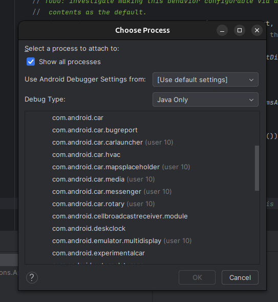

# AOSP Installation Steps


### Create new directory for savin "Repo" source code
```
mkdir ~/bin
```

### Download repo file into `~/bin` folder
```
curl https://storage.googleapis.com/git-repo-downloads/repo > ~/bin/repo
```

### Grant permission to the repo bin so that we can call repo cli
```
chmod a+x ~/bin/repo
```

### Export repo cli bin as PATH env var during the current terminal session
```
export PATH=~/bin:$PATH
```

### Use the command bellow in case you want to verify repo version 
```
repo version
```

### Set git user
```
git config --global user.name Your Name
git config --global user.email you@example.com
```
### Create a new directory for the aosp code init the repo
```
# I'm selecting android-12 to be installed, but you may want to install other version. 
mkdir aosp && cd aosp
repo init -u https://android.googlesource.com/platform/manifest -b android-12.1.0_r9
```

### In order to pull all file to local repo run:
```
repo sync -c -j8
```


source build/envsetup.sh

lunch

make -j8

emulator

https://source.android.com/docs/setup/build/downloading?hl=pt-br


```
sudo apt install openjdk-17-jdk

sudo apt install build-essential
sudo apt install libssl-dev
sudo apt install flex
sudo apt install bison
sudo apt install libncurses5
sudo apt install libxml-simple-perl
sudo apt install m4
sudo apt install python2
sudo apt install python3
sudo apt install python-is-python2
sudo apt install python3.8-venv
sudo apt install python3-pip
sudo apt install python3-demjson
```


https://stackoverflow.com/questions/78857564/unable-to-compile-aosp-source-code-on-ubuntu-24-04-system


[Como compilar o Android (AOSP, Custom ROMs...)](https://www.youtube.com/watch?v=vX8t9l8gnT0)


https://github.com/satur9nine/aosp-docker-build-env


https://github.com/alsutton/aosp-build-docker-images/tree/main


## Install ADB utils
```
sudo apt install google-android-platform-tools-installer
```

## Devices running or connected to the machine (e.g. rasp connect to the usb)

```
adb devices
```

## ADB command list
```
https://gist.github.com/Pulimet/5013acf2cd5b28e55036c82c91bd56d8
```

## Connect
```
adb shell
```

## Restart the emulator  
```
adb reboot
```

## Start the emulator `clean`
```
source build/envsetup.sh && lunch <target-sdk> & emulator -no-snapshot-load -wipe-data
source build/envsetup.sh && lunch sdk_car_x86_64-userdebug & emulator -no-snapshot-load -wipe-data
```

## Connect to logging terminal
```
adb logcat
```




sdk_car_x86_64-userdebug